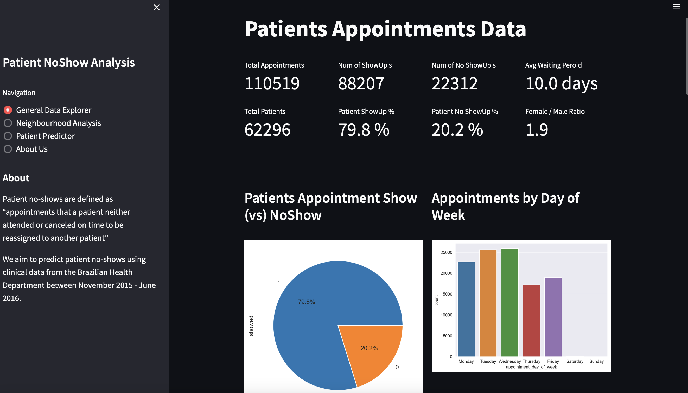
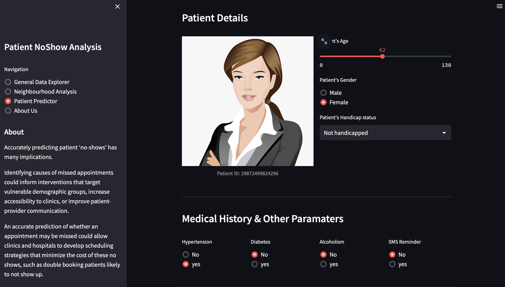

# Predicting Patient No Shows
> #### _Archit, Bruno, Shuai, Zenan | Fall '22 | AIPI 510 Project_
&nbsp;

## Project Description
---
Globally, the delivery of healthcare is constrained by a supply shortage of trained providers and infrastructure. The demands placed on healthcare systems continue to rise as populations grow and age. The pandemic has exposed and further exacerbated this strain on our hospitals, clinics and healthcare providers; it is now more important than ever to develop systems that efficiently allocate resources, minimize cost and keep our patients healthy

Patient no-shows are defined as “appointments that a patient neither attended or canceled on time to be reassigned to another patient”. While ‘no-shows’ directly impact patient health by delaying care and interrupting treatment, they also incur a financial cost

Our project aims to predict patient no-shows using clinical data from the Brazilian Health Department between November 2015 - June 2016. Accurately predicting patient ‘no-shows’ has many implications. Identifying causes of missed appointments could inform interventions that target vulnerable demographic groups, increase accessibility to clinics, or improve patient-provider communication. Moreover, an accurate prediction of whether an appointment may be missed could allow clinics and hospitals to develop scheduling strategies that minimize the cost of these no shows

&nbsp;
## About the Data
---
We have identified three key data sources that we believe will be valuable in predicting the patient show up probablity: patient appointments data, weather data, and hospital ratings data. We combined all the datasets together to predict our binary target variable - Show (Class 0) vs NoShow (Class 1). The primary goal of this prediction is to minimize the cost of missed appointments for hospitals and clinics, thus our primary metric of success will be the recall of our predictions
Find an in-depth description of each datset below:

**1. Patient Appointments Data**

Our primary data set included 14 variables including location of hospital, datetime, and limited patient information as well as our label (no-show - T/F). This dataset contains data of around 110k medical appointments in different neighbourhoods of Brazil. It describes whether the patient showed up or not for the appointment they booked. Following is a high level description of features:
- Patient and appointment ID's
- Schedule and actual appointment day
- Patients age, gender, history of chronic diseases
- Data if reminders were sent to the patient

We conducted exploratory analysis on this dataset to calculate aggregate statistics and identified features that have a high impact on our output. 

**2. Weather Data**

Weather data was gathered using the [Visual Crossing API](https://www.visualcrossing.com/). It was collected for every latitude and longitude (neighbourhood) in brazil on a daily basis between April 2016 and July 2016. It includes a variety of weather parameters like min, max, and average temperature, wind speed, precipitation, solar radiation, uv ndex, humidty etc. 

We merged this data with our appointments dataset to conduct exploratory analysis and identify if weather has an impact on patient show up rate. 

**3. Hospital Ratings Data**

We have information regarding the neighbourhood where the appoinment was booked for. We used [Google Maps Nearby Serach API](https://developers.google.com/maps/documentation/places/web-service/search-nearby) to fetch the ratings of hospitals in a neighbourhood with a defined radius. The places API provides a lot of publically avaible information of places like hosopitals in a given latitude and longitude area such as thier user ratings, operating hours, pricing, photos etc. 

We extracted the average ratings of hospitals in a given neighbourhoods to explore the relation of user ratings on patient show up rate

&nbsp;
## Data Processing and Modelling
---
The patient appointments data is avaiable at a daily level of granuality with 14 features. The datatypes were fixed to interpret numerical columns as integers or floats and string columns as categorical variables. There were outliers in the a few columns like age, which were removed before proceeding for modelling phase. The other sources of data like weather and hospital ratings were sourced from Web API's and cleaned before adding them to our primary dataset. All the raw data was initially dumped into a SQL Database (SQLite)

We engineered some features which we assumed could play a significant role in predicting patient show up. A few examples are - waiting time while booking an appointment, day of the week, age group, number of appointments booked by a patient historically and number of appointments missed in the past. Post processing all the data, we stored everything back in our database. This processed data is used by the models as well as the streamlit app. We used univariate feature selection methods to find irrelevant features and remove them from our training data in order to reduce model complexity. The feature importances from tree models were used for final feature selection during model building phase

We used Grid search to find optimal model performance. Our metric in focus was f1 and we tuned our models to achieve high recall for class 1 (No show) with good amount of precision. Initial model approach was to build one global model for all neighbourhoods in brazil. The model was able to get a high recall, but it was less precise. So we built local models for each neighbourhood present in our dataset, which helped us to be more precise

&nbsp;
## Accessing the Data
---
The raw and processed data is stored in an local SQLite Database. If you would like to setup this Database, you can run the python notebooks present in "data_sourcing" directory to fetch all the data from different sources. Post data souring, run the database.ipynb notebook to setup your data base instance.

&nbsp;
## Running the Code
---

**1. Clone this repository**
```
git clone https://github.com/architkaila/aipi510project
```
**2. Create a conda environment:** 
```
conda create --name environ python=3.7.15
```
**3. Install requirements:** 
```
pip install -r requirements.txt
```
**4. Create a jupyter kernal from this environment:** 
```
python -m ipykernel install --user --name=environ
```
**3. Data Sourcing: Run the following notebooks found at the "data_sourcing" directory of the project**
* Primary dataset is `raw_clinic_data.csv`, present in the data directory
* Run the `data_for_lat_lon.ipynb` file to get the latitude and longitude information for each neighbourhood in our appointments data
* Run the `data_weather.ipynb` to fetch the history of weather data required for modelling. You will need to apply for an API key at [Visual Crossing API](https://www.visualcrossing.com/)
* Run the `data_hospital_ratings.ipynb` to fetch the average ratings of hospitals in each neighbourhood. You will need an API key from [Google Maps Nearby Serach API](https://developers.google.com/maps/documentation/places/web-service/search-nearby)

**4. Database Creation:**
* Run the `database.ipynb` file to setup a database and initialize all data tables with raw unprocessed data

**5. Data Processing and EDA:**
* Run the `EDA_and_DataProcessing.ipynb` file to plot a variety of charts and analytics we conducted on all the three data sources. This file processes all the three datasets, engineers new features, handles outliers and prepares the final data for modelling

**6. Data Modelling:**
* Run the `modelling_v1.ipynb` to build different models like Random foreast, XgBoost, Logistic Regression and to check our data distribution using PCA. This file implements our primary approach to build a global model to predict patient no shows
* Run the `modelling_v2.ipynb` to try out catboost modelling with neighbourhood feature included as a categorical variable
* Run the `modelling_v3.ipynb` to build local models, one for each neighbourhood
* Each modeling file in itslef plots the Precision Recall curves and provides a classification report

&nbsp;
## Streamlit Application: EDA & Model Demo
---
**1. Install requirements for streamlit app (python version>3.7)**
```
pip install -r ./streamlit_app/requirements.txt
```
**2. Run the application**
```
streamlit run ./streamlit_app/streamlit_app.py
```
**3. Data Explorer:**
* Here you can explore all the EDA we conducted across different features available
>

**4. Patient NoShow Predictor:**
* Here you can play with the model, vary the inputs and press the predict button to see if the patient will show up for the appointment or not
>

